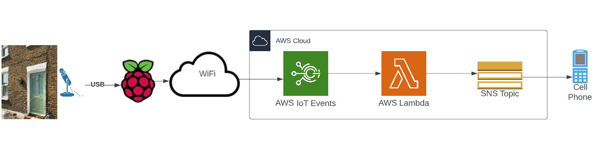

# raspberry-pi-iot-cat-doorbell

  
This is a setup to alert me when our cat is meowing at the door and wants to be let in. If the door is closed, and the
cat goes 'meow' while outside, then I get an SMS message on my cell.
  

# Technical Description

This is an IoT application. AWS MQTT software is loaded on a single Raspberry Pi that has an attached microphone. WHen
the correct
sound (in this case a cat meowing) is detected, the Raspberry Pi forwards a message to AWS. AWS IoT intercepts the
message and
sends the message to a Lambda function for formatting. The Lambda function then forwards the message to an SNS topic
which then sends
it as an SMS message to my cell phone.
  

# High Level Design 

  

# Prerequisites 

1. An AWS account
2. A raspberry pi 4 (see hardware parts listed below)
3. Raspberry Pi imaging software
     

# Software Requirements

## Raspberry Pi Configuration

Before you can use your raspberry pi, there are several things you need to configure on it.

### Loading the OS

First, we have to load the OS on a micro SD card. Then, we take the card and install it on your raspberry pi.

#### Imaging the disk

#### Booting the OS

#### SSH into the environment

### AWS Credentials Configuration

### Generating keys

### Adding keys to your RPi environment

  

# Directions 

## Software Setup

### Raspberry Pi Configuration

#### Tensorflow Lite

#### MQTT (Message Queue Telemetry Transport)

  

### AWS Configuration

#### IOT (Internet of Things)

#### SMS (Simple Messaging Service)

#### SNS (Simple Notification Service)

#### Lambda Function

  

### Test

  

# Hardware Parts List  

1. Raspberry Pi 4
2. micro SD Card
3. RPi Chassis
4. Microphone
5. USB cable
6. Raspberry Pi 4 power supply
7. Hobby box (to house the microphone)
8. silicone caulking
9. Drill
10. 1/4" drill bit
11. Female USB adapter
12. Male USB adapter
13. 2 wood screws
14. cable wire clips
15. double-sided tape
16. wire cutters
17. micro SD card reader

  

# AWS Steps

1. Create the "thing" on AWS
2. Download the thing configuration zip file
3. Update the security policy
4. Create message routing rule
5. Configure Rule SQL statement
6. Point rule to Lambda function
7. Create Lambda function
8. Create the SNS topic
9. Create the SMS subscription (i.e. define the telephone number)
10. Subscribe to the SNS topic with the SMS subscription
11. Update IAM role policy with correct permissions