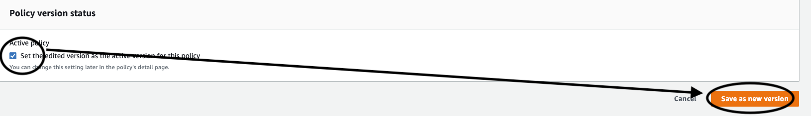

# raspberry-pi-iot-cat-doorbell


# Overview

This is a setup to alert me when our cat is meowing at the door and wants to be let in. If the door is closed, and the
cat goes 'meow' while outside, then I get text message on my cell phone.
<br><br>

# Table of Contents
  - [Technical Description](#technical-description)
  - [High Level Design<br>](#high-level-design<br>)
  - [Pictures](#pictures)
  - [Prerequisites](#prerequisites)
  - [Construction](#construction)
  - [STEP 1](#-raspberry-pi-initial-configuration)
  - [STEP 2](#-aws-configuration)
  - [STEP 3](#-test-iot-functionality)
  - [STEP 4](#-assembly)
  - [Parts List <br>](#parts-list-<br>)
  - [Hardware Notes](#hardware-notes)
  - [FAQ](#faq)


# Technical Description

This is an Amazon Web Services (AWS) Internet of Things (IoT) application. A single Raspberry Pi is defined as a "thing" 
on AWS in the IoT Core service. AWS software is loaded on the Raspberry Pi which has an attached microphone. Onboard the 
Raspberry Pi is a small Machine Learning (ML) application called Tensorflow Lite. Along with Tensorflow, there is a 
small database of sounds it is able to identify. WHen the correct sound (in this case a cat meowing) is detected, 
the Tensorflow recognizes it and forwards a message to AWS. AWS IoT intercepts the message and sends the message to 
an AWS Lambda function for formatting. The Lambda function then forwards the message to an SNS (Simple Notification Service) 
topic which then sends it as an SMS text message to my cell phone.
<br><br>

# High Level Design<br>


<br><br>

# Pictures

<br>
Here is the RPi attaching the USB connection to a USB-to-RJ45 connection. THe cable it attaches to is a standard cat5e cable.

<br>
This is the "doorbell" portion.  It is situated outside next to the location where a cat is expected to be meowing for entry.

<br>
This is what is inside the box.  Note the small microphone at the end of the USB-to-RJ45 connector.

<br>
These are holes drilled into the box to allow sound to be heard by the microphone.

<br>
The doorbell in use

<br><br>
# Prerequisites

1. An AWS (Amazon Web
   Services) [account](https://aws.amazon.com/premiumsupport/knowledge-center/create-and-activate-aws-account/)
2. [A Raspberry Pi 4](https://www.amazon.com/dp/B08Q8L3B9D?ref_=cm_sw_r_cp_ud_dp_70VG7MF3JGCHTGZKZGG4) (see hardware
   parts listed below)
3. [Raspberry Pi imaging software](https://www.raspberrypi.com/software/)
   <br><br>

# Construction

# STEP 1: Raspberry Pi Initial Configuration

1. Load the operating system. See the procedure [here](https://youtu.be/u8bbp79haN4)<br>
   NOTE: Install the new *64-bit* version of the operating system.<br>

2. SSH to your Raspberry Pi once you have it configured

3. Clone a copy of this repository

```bash
    git clone https://github.com/gamename/raspberry-pi-iot-cat-doorbell.git
```

4. Using Python, install the required packages

```bash
    cd ~/raspberry-pi-iot-cat-doorbell/raspberry_pi
    pip install -r requirements.txt
```

5. Install the AWS CLI (Command Line Interface)

```bash
    pip install awscli
```

6. Add this to the bottom of your shell startup file (.bashrc or .zshrc):
```bash
    export PATH=${HOME}/.local/bin:${PATH}
```

7. Using your AWS account, create and install the access and secret keys as
   described [here](https://docs.aws.amazon.com/cli/latest/userguide/cli-configure-quickstart.html)

```bash
    aws configure
```

8. Verify you have everything configured by issuing this command (below). If you do not get any errors, you are
   configured correctly.

```bash
    aws s3 ls
```

<br><br>

# STEP 2: AWS Configuration
### NOTES:<br>- This cookbook assumes AWS region `us-east-1`<br>- Somtimes 'cat' is spelled 'kat' below. Ignore it. Always assume 'cat'. I had to do that to keep from conflicting with existing definitions.

1. Create the "thing" [definition](https://us-east-1.console.aws.amazon.com/iot/home?region=us-east-1#/connectdevice) on
   AWS by following the directions.<br>
2. When offered, select "Python" as the IoT SDK type<br>
   
3. Download the thing configuration zip file to the Raspberry Pi. Probably the easiest way to do this is:<br>
   a. Download the zip file to your laptop. Do NOT unzip it<br>
   <br>
   b. [sftp](https://www.digitalocean.com/community/tutorials/how-to-use-sftp-to-securely-transfer-files-with-a-remote-server) from your laptop to the RPi<br> 
   c. 'put' the thing configuration zip file to the Raspberry Pi from the laptop<br>
   <br>
4. Unzip the file on the Raspberry Pi.  It should look something like this:<br>
   <br>
5. Continue following the directions and run the `start.sh` script.<br> 
6. You should see test messages on AWS being sent from the `start.sh` script:<br> 
   <br> 
7. Update the security policy by going here:<br>
   <br>
8. Then edit your policy by selecting it on the left and hitting the "Edit" button:<br>
   <br>
9. Click on the "JSON" button on the right, and you should see something like this:<br>
   <br> 
10. In the first "Resource" definition, you should add the following:<br>
    ```bash
    "arn:aws:iot:us-east-1:<your-aws-id>:topic/<your-initials>/bot/kat-doorbell"
    ```
11. In the second "Resource" definition, you should add this:<br>
    ```bash
     "arn:aws:iot:us-east-1:<your-aws-id>:topicfilter/<your-initials>/bot/kat-doorbell"
    ```
12. In the third "Resource" definition, you should add the following:<br>
    ```bash
        "arn:aws:iot:us-east-1:<your-aws-id>:client/doorbell",
        "arn:aws:iot:us-east-1:<your-aws-id>:client/doorbell-test"
    ```
13. The finished product should be:<br>
<br>
14. Save the finished product as the new version<br>
    <br>
15. Now, click on the message routing rules<br>
    <br>
16. Click on "Create Rule", then name your rule "kat_doorbell" and hit "Next"<br>
17. Set the SQL statement to the following:<br>
    ` select message from '<your-initials>/bot/kat-doorbell' Where startswith(message, 'MSG002')`
18. Hit the "Next" button and choose "Lambda" from the fold-down list of actions<br>  
19. Click on "Create Lambda Function"<br>
20. Name the function "kat-doorbell" and select Python as the runtime:<br>
    
21. Click on "Create Function" 
22. In the code IDE provided, paste the contents of the file `cat-doorbell-msg-munger.py`:<br>
    <br>
23. Click the "Deploy" button.<br>
24. Now go back to the message routing tab.  Click on the update circle button and then select the new lambda function from the list:<br>
<br>
25. Click on the "Next" button and click "Create" on the next page:<br> 
<br>
26. Now, we need to create the Simple Notification Service (SNS) topic. This is used to pass messages to SMS for text messages.<br>
27. Go to [SNS Topics](https://us-east-1.console.aws.amazon.com/sns/v3/home?region=us-east-1#/topics). 
28. Create a new "standard" topic called "kat-doorbell":<br>
<br>
29. Now, copy the ARN of the topic:<br>
<br>
30. Go back to the lambda function "kat-doorbell".
31. Click on "Configuration", then "Environment Variables":<br>
<br>
32. Edit the environment variables. Create a new one called "CAT_DOORBELL_SNS_TOPIC_ARN".<br>
<br> 
33. Click on "Save"<br>
34. Next, we need to [create a new phone number](https://us-east-1.console.aws.amazon.com/pinpoint/home?region=us-east-1#/sms-account-settings/phoneNumbers) so that we can send SMS messages. <br>
<br>
35. On the provided screen, select the options shown below<br>
<br>
36. Go to SNS and add your new phone number:<br>
<br>
<br>
37. In SNS, create a new subscription:<br>
<br>
38. Next, we need to set permissions for us to send SNS messages. <br> 
39. Go to the [Identity and Access Management](https://us-east-1.console.aws.amazon.com/iamv2/home#/home) (IAM) page in AWS.<br>
40. Click on "Roles" on the left.<br>
<br>
41. In the search field, type in "kat-doorbell". You should get something like this:<br>
<br>
42. Click on the entry, and then click on the long policy name:<br>
<br>
43. Then, click on "Edit Policy":<br>
<br>
44. Replace the entire contents with this:<br>
    ```json
    {
        "Version": "2012-10-17",
        "Statement": [
            {
                "Effect": "Allow",
                "Action": [
                    "logs:CreateLogGroup",
                    "logs:CreateLogStream",
                    "logs:PutLogEvents",
                    "SNS:Publish"
                ],
                "Resource": "*"
            }
        ]
    }
    ```
45. Click on "Review" and then save the policy contents.<br>

<br><br>

# STEP 3: Test IoT Functionality
1. Go to your [IoT settings](https://us-east-1.console.aws.amazon.com/iot/home?region=us-east-1#/settings) on AWS. 
2. Copy the "Endpoint" value:<br>
<br>
3. ssh to your Raspberry Pi and edit the `raspberry-pi-iot-cat-doorbell/raspberry_pi/test/drive-doorbell-test.sh` file:<br>
4. Paste the endpoint value in the `--endpoint` field and update the `--topic` field accordingly.<br>
5. Run the `drive-doorbell-test.sh` command. You should see the results on your cell phone. :)
6. If you DO NOT see a message on your cell phone, look at the [CloudWatch logs](https://us-east-1.console.aws.amazon.com/cloudwatch/home?region=us-east-1#logsV2:log-groups) for clues about what went wrong.<br>

<br><br>

# STEP 4: Assembly
1. Update the `raspberry-pi-iot-cat-doorbell/raspberry_pi/start-doorbell.sh` file like you did in STEP 3 (above).<br>
2. Now we will make sure the doorbell is active at boot time.  To do that, update the Raspberry Pi file `/etc/rc.local` with this change:<br> 
```bash
sudo su -c "/home/your-id/raspberry-pi-iot-cat-doorbell/raspberry_pi/start-doorbell.sh" -s /bin/sh your-id 
```
Example:
```bash
#!/bin/sh -e
#
# rc.local
#
# This script is executed at the end of each multiuser runlevel.
# Make sure that the script will "exit 0" on success or any other
# value on error.
#
# In order to enable or disable this script just change the execution
# bits.
#
# By default this script does nothing.

# Print the IP address
_IP=$(hostname -I) || true
if [ "$_IP" ]; then
  printf "My IP address is %s\n" "$_IP"
fi
sudo su -c "/home/tennis/raspberry-pi-iot-cat-doorbell/raspberry_pi/start-doorbell.sh" -s /bin/sh tennis

exit 0
```
3. Attach the USB-to-RJ45 adapter to one of the USB2.0 ports.
4. Connect the RJ45 cable to the adapter and run it to your termination spot (i.e. where your cat will be yelling to be let in).
5. Attach the RJ45-to-USB adapter to the other end of the RJ45 cable.
6. Then attach the microphone to the USB connector.
7. Test the whole thing by playing [this video](https://youtu.be/uLB1ZeRgl_k) while holding your phone near the microphone.
<br><br>

# Parts List <br>

1. [Raspberry Pi 4](https://a.co/d/iTeahRb)
2. [Micro SD Card](https://a.co/d/gPUG9wK)
3. [RPi Chassis](https://a.co/d/fNzIn9r)
4. [Microphone](https://a.co/d/79ZNPXm)
5. [RJ45 ethernet cable](https://a.co/d/4nUaynw) (to extend the USB connection)
6. [Raspberry Pi 4 power supply](https://a.co/d/7sYmfgP)
7. [Hobby box](https://a.co/d/1OaFHOC) (to house the microphone outside)
8. [silicone caulk](https://a.co/d/iZSnaku)
9. Drill
10. 1/4" drill bit
11. [RJ45-to-USB adapters](https://a.co/d/iqZkoYu) 
12. 2 wood screws (to secure the microphone-in-a-box to the door frame)  
13. [cable wire clips](https://a.co/d/1oKEFx6)
14. [double-sided tape](https://a.co/d/fFFFt39)
15. micro SD card reader (maybe not needed if your laptop already has a reader)
16. [RJ45 crimping tool](https://a.co/d/4zkLy3x)
17. [Cord hiders](https://a.co/d/2iqsGGe)

<br><br>
# Hardware Notes
1. Use the rj45/ethernet cable to extend the USB connection to the microphone. The USB-to-RJ45 adapters enable you to go up to about 150 feet from the RPi to the microphone.
2. Since the rj45 needs to connect to the microphone *inside* the hobby box, I had to cut off the RJ45 adapter, run the cable into the box via a hole, then reattach a new RJ45 adapter. YMMV
<br><br>

# FAQ
Q. How long does this take to set up?<br>
A. Once you have all the parts - including the new phone number - you could probably do it in an afternoon<br>
<br><br>
Q. Could this be used for a dog?<br>
A. Yes. Change "Cat" on line 138 in `doorbell.py` to "Dog" <br>
<br><br>
Q. Why didn't you do this using Terraform?<br>
A. Terraform is an excellent tool, but not everyone knows how to use it.  So, I opted for a manual approach to be 
accessible to a wider audience.<br>
<br><br>
Q. Why did I use AWS for SMS instead of IFTTT or some other service?<br>
A. I'm exploring AWS for lots of different services, so I wanted to try it this way instead.<br>
<br><br>
Q. Why not just make your cat an indoor cat and avoid this whole problem?<br>
A. Technically, he is and indoor cat. His name is "Milo", by the way. The outside area we let Milo roam is a gated back patio which lets him _think_ he is really outside.<br>
<br><br>
Q. What's the monthly cost of this configuration?<br>
A. About $11.00 (including the toll-free number from Amazon)<br>
<br><br>
Q. Do I really need a Raspberry Pi 4 for this?<br>
A. Unfortunately, yes. Tensorflow requires it.<br>
<br><br>
Q. Can the Amazon toll-free number be used for other IoT applications?<br>
A. Yes, I have [another project](https://github.com/gamename/raspberry-pi-iot-garage-sensor) which does just that.<br>
<br><br>
Q. What happens if you have *multiple* cats? Will this still work?<br>
A. Yes. The Tensorflow library doesn't differentiate between different cats.  A meow is a meow as far as its concerned. Ditto dogs and barks.<br>
<br><br>
Q. Outside where my cat will be is pretty noisy. Will Tensorflow be able to discern the meow under those conditions?<br>
A. We have a loud air conditioner and Tensorflow can still pick up the meow sound.  So its likely you can still make it work. YMMV!<br>
<br><br>