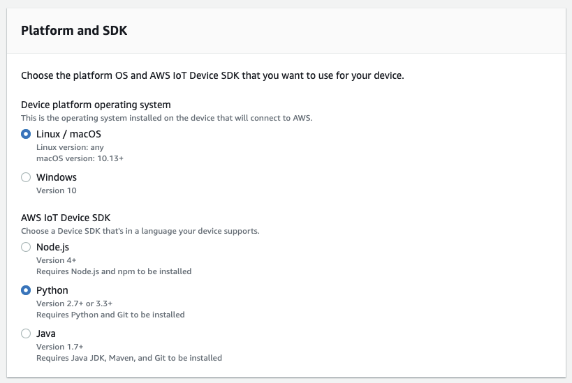
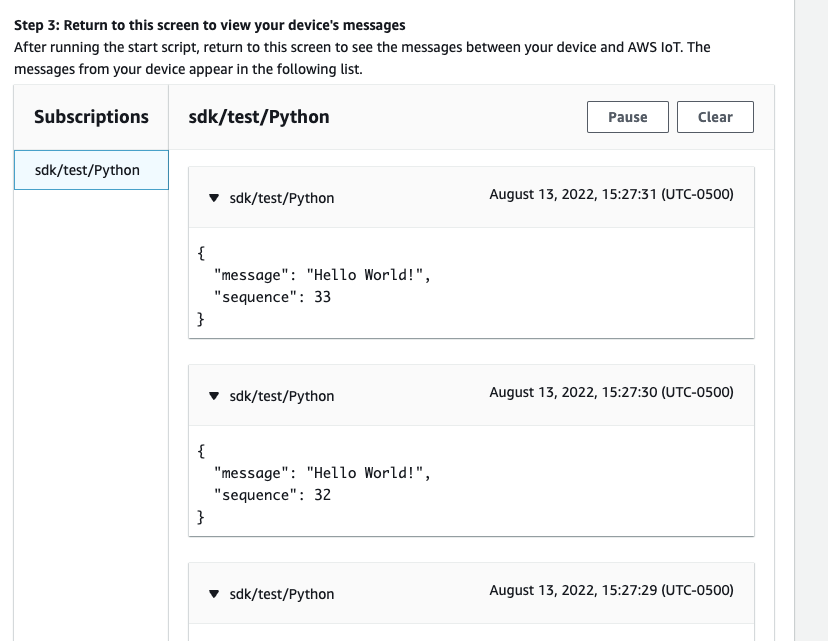
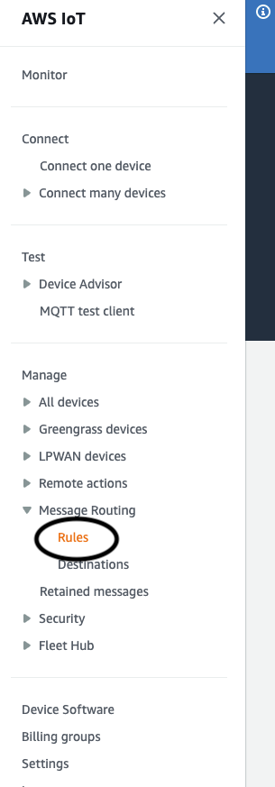

# raspberry-pi-iot-cat-doorbell

<br><br>
This is a setup to alert me when our cat is meowing at the door and wants to be let in. If the door is closed, and the
cat goes 'meow' while outside, then I get text message on my cell phone.
<br><br>

# Technical Description

This is an Amazon Web Services (AWS) Internet of Things (IoT) application. A single Raspberry Pi is defined as a "thing" 
on AWS in the IoT Core service. AWS software is loaded on the Raspberry Pi which has an attached microphone. Onboard the 
Raspberry Pi is a small Machine Learning (ML) application called Tensorflow Lite. Along with Tensorflow, there is a 
small database of sounds it is able to identify. WHen the correct sound (in this case a cat meowing) is detected, 
the Tensorflow recognizes it and forwards a message to AWS. AWS IoT intercepts the message and sends the message to 
an AWS Lambda function for formatting. The Lambda function then forwards the message to an SNS (Simple Notification Service) 
topic which then sends it as an SMS text message to my cell phone.
<br><br>

# High Level Design<br>


<br><br>

# Prerequisites<br>

1. An AWS (Amazon Web
   Services) [account](https://aws.amazon.com/premiumsupport/knowledge-center/create-and-activate-aws-account/)
2. [A Raspberry Pi 4](https://www.amazon.com/dp/B08Q8L3B9D?ref_=cm_sw_r_cp_ud_dp_70VG7MF3JGCHTGZKZGG4) (see hardware
   parts listed below)
3. [Raspberry Pi imaging software](https://www.raspberrypi.com/software/)
   <br><br>

# STEP 1: Raspberry Pi (RPi) Initial Configuration

1. Load the operating system. See the procedure [here](https://youtu.be/u8bbp79haN4)<br>
   NOTE: Install the new *64-bit* version of the operating system.<br>

2. SSH to your Raspberry Pi once you have it configured

3. Clone a copy of this repository

```bash
    git clone https://github.com/gamename/raspberry-pi-iot-cat-doorbell.git
```

4. Using Python, install the required packages

```bash
    cd ~/raspberry-pi-iot-cat-doorbell/raspberry_pi
    pip install -r requirements.txt
```

5. Install the AWS CLI (Command Line Interface)

```bash
    pip install awscli
```

6. Using your AWS account, create and install the access and secret keys as
   described [here](https://docs.aws.amazon.com/cli/latest/userguide/cli-configure-quickstart.html)

```bash
    aws configure
```

7. Verify you have everything configured by issuing this command (below). If you do not get any errors, you are
   configured correctly.

```bash
    aws s3 ls
```

<br><br>

# STEP 2: AWS Configuration

1. Create the "thing" [definition](https://us-east-1.console.aws.amazon.com/iot/home?region=us-east-1#/connectdevice) on
   AWS by following the directions.<br>
2. When offered, select "Python" as the IoT SDK type<br>
   
3. Download the thing configuration zip file to the Raspberry Pi. Probably the easiest way to do this is:<br>
   a. Download the zip file to your laptop. Do NOT unzip it<br>
   <br>
   b. [sftp](https://www.digitalocean.com/community/tutorials/how-to-use-sftp-to-securely-transfer-files-with-a-remote-server) from your laptop to the RPi<br> 
   c. 'put' the thing configuration zip file to the Raspberry Pi from the laptop<br>
   <br>
4. Unzip the file on the Raspberry Pi.  It should look something like this:<br>
   <br>
5. Continue following the directions and run the `start.sh` script.<br> 
6. You should see test messages on AWS being sent from the `start.sh` script:<br> 
   <br> 
7. Update the security policy by going here:<br>
   <br>
8. Then edit your policy by selecting it on the left and hitting the "Edit" button:<br>
   <br>
9. Click on the "JSON" button on the right, and you should see something like this:<br>
   <br> 
10. In the first "Resource" definition, you should add the following:<br>
    ```bash
    "arn:aws:iot:us-east-1:<your-aws-id>:topic/<your-initials>/bot/kat-doorbell"
    ```
11. In the second "Resource" definition, you should add this:<br>
    ```bash
     "arn:aws:iot:us-east-1:<your-aws-id>:topicfilter/<your-initials>/bot/kat-doorbell"
    ```
12. In the third "Resource" definition, you should add the following:<br>
    ```bash
        "arn:aws:iot:us-east-1:<your-aws-id>:client/doorbell",
        "arn:aws:iot:us-east-1:<your-aws-id>:client/doorbell-test"
    ```
13. The finished product should be:<br>
<br>
14. Save the finished product as the new version<br>
    <br>
15. Now, click on the message routing rules<br>
    <br>
16. Click on "Create Rule", then name your rule "kat_doorbell" and hit "Next"<br>
17. Set the SQL statement to the following:<br>
    ` select message from '<your-initials>/bot/kat-doorbell' Where startswith(message, 'MSG002')`
18. Hit the "Next" button and choose "Lambda" from the fold-down list of actions<br>  
19. Click on "Create Lambda Function"<br>
20. Name the function "kat-doorbell" and select Python as the runtime:<br>
    
21. Click on "Create Function" 
22. In the code IDE provided, paste the contents of the file `cat-doorbell-msg-munger.py`:<br>
    
23. Click the "Deploy" button.
24. Now go back to the message routing tab.  Click on the update circle button and then select the new lambda function from the list:<br>
<br>
25. Click on the "Next" button and click "Create" on the next page:<br> 
<br>

10. Point rule to Lambda function
11. Create Lambda function
12. Create the SNS topic
13. Create the SMS subscription (i.e. define the telephone number)
14. Subscribe to the SNS topic with the SMS subscription
15. Update IAM role policy with correct permissions
<br><br>

# STEP 3: Assembly
1. WIP - TBD 
<br><br>

# Hardware Parts List <br>

1. [Raspberry Pi 4](https://a.co/d/iTeahRb)
2. [Micro SD Card](https://a.co/d/gPUG9wK)
3. [RPi Chassis](https://a.co/d/fNzIn9r)
4. [Microphone](https://a.co/d/79ZNPXm)
5. [RJ45 ethernet cable](https://a.co/d/4nUaynw) (to extend the USB connection)
6. [Raspberry Pi 4 power supply](https://a.co/d/7sYmfgP)
7. [Hobby box](https://a.co/d/1OaFHOC) (to house the microphone outside)
8. [silicone caulk](https://a.co/d/iZSnaku)
9. Drill
10. 1/4" drill bit
11. [RJ45-to-USB adapters](https://a.co/d/iqZkoYu) 
12. 2 wood screws (to secure the microphone-in-a-box to the door frame)  
13. [cable wire clips](https://a.co/d/1oKEFx6)
14. [double-sided tape](https://a.co/d/fFFFt39)
15. micro SD card reader (maybe not needed if your laptop already has a reader)
16. [RJ45 crimping tool](https://a.co/d/4zkLy3x)
17. [Cord hiders](https://a.co/d/2iqsGGe)

<br><br>
# NOTES
1. Use the rj45/ethernet cable to extend the USB connection to the microphone. The USB-to-RJ45 adapters enable you to go up to about 150 feet from the RPi to the microphone.
2. Since the rj45 needs to connect to the microphone *inside* the hobby box, I had to cut off the RJ45 adapter, run the cable into the box, then reattach a new RJ45 adapter. YMMV
<br><br>

# FAQ

Q. How much will this cost?<br>
A. ????
<br><br>
Q. How long does this take to set up?<br>
A. Once you have all the parts, you could probably do it in an afternoon
<br><br>
Q. Could this be used for a dog?<br>
A. Yes. Change the FIXME FIXME
<br><br>
Q. Why didn't you do this using Terraform?<br>
A. Terraform is an excellent tool, but not everyone knows how to use it.  So, I opted for a manual approach to be 
accessible to a wider audience.
<br><br>
